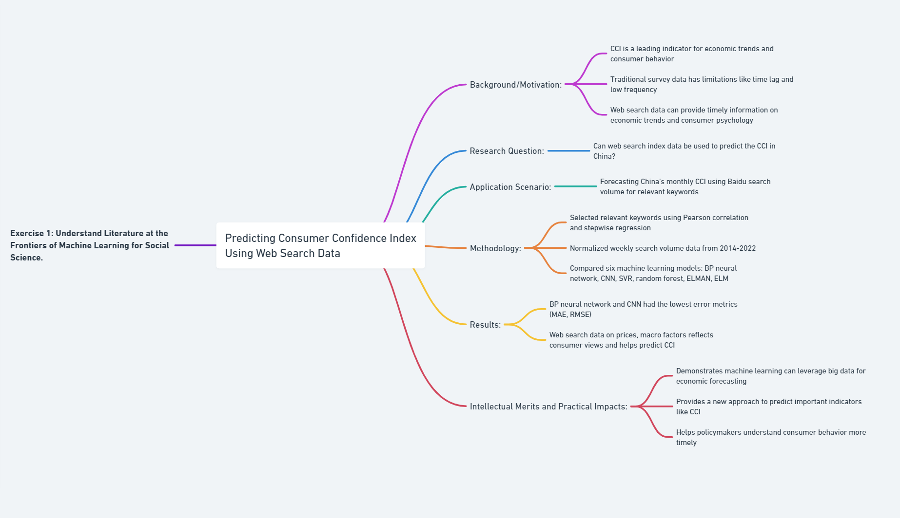
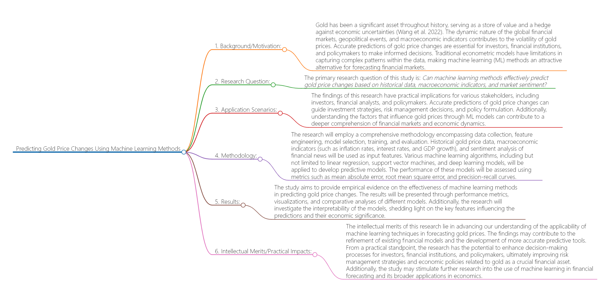

# Part I
## 1.1
### The research leverages machine learning in a predictive modeling approach to forecast an important economic indicator using novel web search data. It demonstrates a practical application of AI for data-driven prediction in the social sciences. 
### Background/Motivation:
- The consumer confidence index (CCI) is an important leading indicator for predicting future economic trends and consumer behavior. However, traditional survey data used to calculate CCI has limitations like time lag and low frequency.
Web search data contains timely information that reflects economic trends and consumer psychology. Using machine learning models on this big data could help forecast CCI more accurately.
### Research Question:
- Can web search index data be used with machine learning models to effectively predict the consumer confidence index in China?
### Application Scenario:
- Forecasting China's monthly consumer confidence index using search volume for relevant keywords on Baidu as predictor variables.
### Methodology:
- Selected 64 keywords related to CCI, narrowed down to 8 keywords with highest correlation using Pearson and stepwise regression.
- Normalized weekly search volume data from 2014-2022.
- Compared 6 machine learning models - BP neural network, CNN, SVR, random forest, ELMAN, ELM.
### Results:
- BP neural network and CNN had the lowest error metrics like MAE and RMSE compared to other models.
- Web search data on prices, macro factors, etc. reflects consumer views and helps predict CCI using machine learning.
### Intellectual Merits and Practical Impacts:
- Demonstrates machine learning can leverage big data like search trends for economic forecasting.
- Provides a new data-driven approach to predict important indicators like CCI.
- Can help policymakers understand consumer behavior and confidence more timely.
- It could be extended to forecast other macroeconomic indicators similarly.
### Flowchart
- 
### Citation
- Han, Huijian, et al. “Using Machine Learning Methods to Predict Consumer Confidence from Search Engine Data.” Sustainability, vol. 15, no. 4, 8 Feb. 2023, p. 3100, https://doi.org/10.3390/su15043100.

# Part II

## Predicting Gold Price Changes Using Machine Learning Methods

### 1. Background/Motivation:

- Gold has been a significant asset throughout history, serving as a store of value and a hedge against economic uncertainties  (Qian, Ralescu, and Zhang 2019). The dynamic nature of the global financial markets, geopolitical events, and macroeconomic indicators contributes to the volatility of gold prices (Qian, Ralescu, and Zhang 2019). Accurate predictions of gold price changes are essential for investors, financial institutions, and policymakers to make informed decisions. Traditional econometric models have limitations in capturing complex patterns within the data, making machine learning (ML) methods an attractive alternative for forecasting financial markets (S Aruna, P. Uma Maheswari, and J. Sujipriya 2021).

### 2. Research Question:

- The primary research question of this study is: *Can machine learning methods effectively predict gold price changes based on CPI*

### 3. Application Scenarios:

- The findings of this research have practical implications for various stakeholders, including investors, financial analysts, and policymakers. Accurate predictions of gold price changes can guide investment strategies, risk management decisions, and policy formulation. Additionally, understanding the factors that influence gold prices through ML models can contribute to a deeper comprehension of financial markets and economic dynamics.

### 4. Methodology:

- The research will employ a comprehensive methodology encompassing data collection, feature engineering, model selection, training, and evaluation. Historical gold price data, macroeconomic indicators (such as CPI), and sentiment analysis of financial news will be used as input features. Various machine learning algorithms, including but not limited to linear regression, support vector machines, and deep learning models, will be applied to develop predictive models. The performance of these models will be assessed using metrics such as mean absolute error, root mean square error, and precision-recall curves.

### 5. Results:

- The study aims to provide empirical evidence on the effectiveness of machine learning methods in predicting gold price changes. The results will be presented through performance metrics, visualizations, and comparative analyses of different models. Additionally, the research will investigate the interpretability of the models, shedding light on the key features influencing the predictions and their economic significance.

### 6. Intellectual Merits/Practical Impacts:

- The intellectual merits of this research lie in advancing our understanding of the applicability of machine learning techniques in forecasting gold prices. The findings may contribute to the refinement of existing financial models and the development of more accurate predictive tools. From a practical standpoint, the research has the potential to enhance decision-making processes for investors, financial institutions, and policymakers, ultimately improving risk management strategies and economic policies related to gold as a crucial financial asset. Additionally, the study may stimulate further research into the use of machine learning in financial forecasting and its broader applications in economics.
### Flowchart

### Citation
- Qian, Yao, et al. “The Analysis of Factors Affecting Global Gold Price.” Resources Policy, vol. 64, no. 0301-4207, Dec. 2019, p. 101478, https://doi.org/10.1016/j.resourpol.2019.101478.
- S Aruna, et al. “Prediction of Potential Gold Prices Using Machine Learning Approach.” Annals of the Romanian Society for Cell Biology, 9 Apr. 2021, pp. 1385–1396. Accessed 3 Nov. 2023.

# Citations
```
@article{han2023using,
  title={Using Machine Learning Methods to Predict Consumer Confidence from Search Engine Data},
  author={Han, Huijian and Li, Zhiming and Li, Zongwei},
  journal={Sustainability},
  volume={15},
  number={4},
  pages={3100},
  year={2023},
  publisher={MDPI}
}
@article{qian2019analysis,
  title={The analysis of factors affecting global gold price},
  author={Qian, Yao and Ralescu, Dan A and Zhang, Bo},
  journal={Resources Policy},
  volume={64},
  pages={101478},
  year={2019},
  publisher={Elsevier}
}
@article{aruna2021prediction,
  title={Prediction of potential gold prices using machine learning approach},
  author={Aruna, S and Umamaheswari, P and Sujipriya, J and others},
  journal={Annals of the Romanian Society for Cell Biology},
  pages={1385--1396},
  year={2021}
}
```

