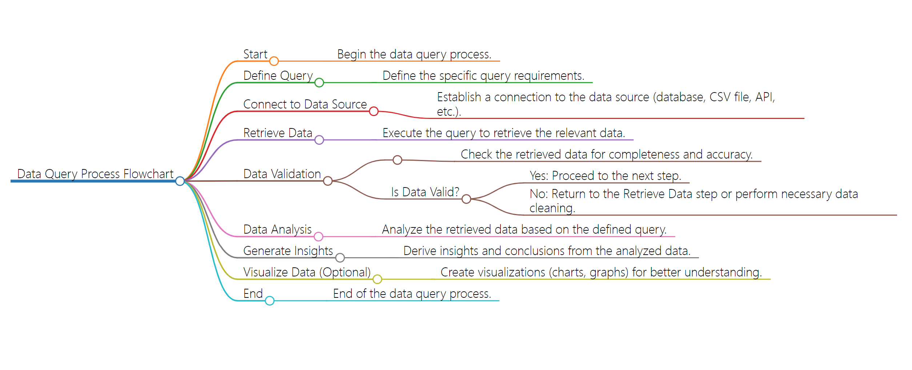

# Code
## Code Descrption
-  The data query process for the provided Python code involves reading a CSV file containing historical data with columns "Date" and "CPI" representing the Consumer Price Index. The pandas library is employed to load and manipulate the data. Initially, the dataset is loaded into a DataFrame. Subsequently, the user might employ various query methods, such as filtering by date ranges or selecting specific columns, to extract relevant information. Machine learning methods can be applied to predict gold prices based on the CPI data, forming a predictive model. This iterative process may include feature engineering, model training, and evaluation. The query process is crucial for understanding the dataset's structure and extracting pertinent information to facilitate effective predictive modeling and analysis.
## Pseudo-code
```
# Import necessary libraries
import pandas as pd
from sklearn.model_selection import train_test_split
from sklearn.linear_model import LinearRegression
from sklearn.metrics import mean_squared_error
import matplotlib.pyplot as plt

# Read CSV file into a DataFrame
data = pd.read_csv('your_dataset.csv')

# Extract features (Date) and target variable (CPI)
features = data['Date']
target = data['CPI']

# Convert Date to datetime format
features = pd.to_datetime(features, format='%d-%m-%Y')

# Split the data into training and testing sets
features_train, features_test, target_train, target_test = train_test_split(features, target, test_size=0.2, random_state=42)

# Train a linear regression model
model = LinearRegression()
model.fit(features_train.values.reshape(-1, 1), target_train)

# Make predictions on the test set
predictions = model.predict(features_test.values.reshape(-1, 1))

# Evaluate the model
mse = mean_squared_error(target_test, predictions)
print(f'Mean Squared Error: {mse}')

# Visualize the results
plt.scatter(features_test, target_test, color='black')
plt.plot(features_test, predictions, color='blue', linewidth=3)
plt.title('Linear Regression Model')
plt.xlabel('Date')
plt.ylabel('CPI')
plt.show()
```
## Flowchart
