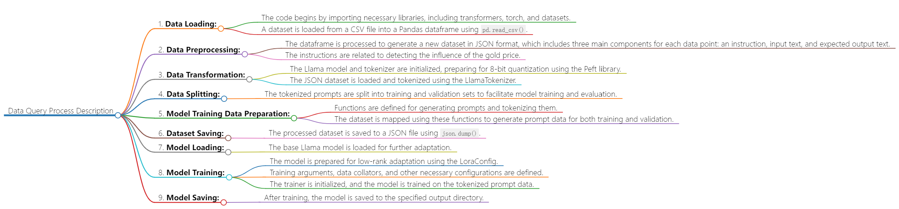

# Data
## Data Descrption
- The data shows the Consumer Price Index (CPI) in the United States underwent various fluctuations during the early 20th century. In 1913, the CPI stood at 9.8, and it experienced minor variations in the subsequent months. By the end of 1915, there was a modest increase to 10.3. The years leading up to World War I saw a steady rise, reaching 13.7 in December 1917. The war period witnessed significant inflation, with the CPI climbing to 18.9 by December 1919. The post-war era of the early 1920s saw a gradual decline, hitting 19.4 in December 1920. The economy experienced deflation in the early 1920s, with the CPI reaching a low of 13.1 in December 1932 during the Great Depression. The subsequent years leading to World War II and beyond witnessed a gradual but steady increase, with occasional fluctuations. By the mid-1960s, the CPI had surpassed 32.9, reflecting the changing economic landscape during that period.
## Table
| **Variable** 	|    **Definition**    	|                              **Description**                              	| **Frequency** 	| **Type** 	|
|:------------:	|:--------------------:	|:-------------------------------------------------------------------------:	|:-------------:	|:--------:	|
|      CPI     	| Consumer Price Index 	| Measures changes in prices paid by urban consumers for goods and services 	|    Monthly    	|  Numeric 	|
## Flowchart
- 